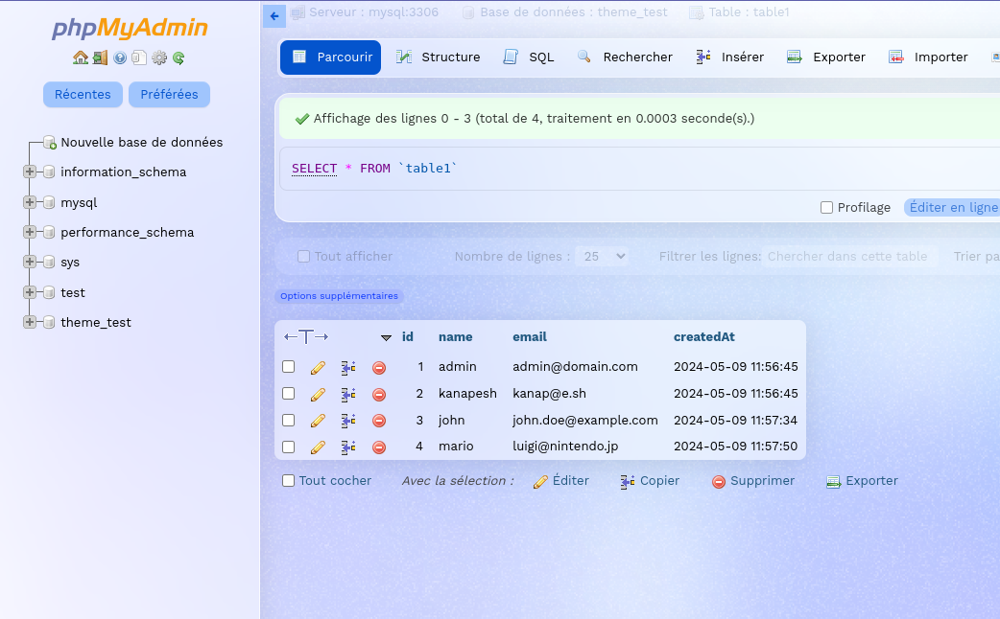

# Glass theme for phpMyAdmin

This is a theme for phpMyAdmin 5.X that is inspired by the glassmorphism design trend.

## Screenshots 📷



## Installation 🛠️

To install the theme, you need to copy the `glass` folder to the `themes` folder of your phpMyAdmin installation.

```bash
git clone https://github.com/Kan-A-Pesh/pma-glass-theme.git
cp -r pma-glass-theme /path/to/phpmyadmin/themes
```

_(Optional)_ You can also edit the `config.inc.php` file in the root of your phpMyAdmin installation and set the theme to `glass` by default.

```php
$cfg['ThemeDefault'] = 'glass';
```

Otherwise, you can select the theme from the settings page of phpMyAdmin.

Congratulations! 🎉\
You have successfully installed the theme.

## Usage 🚀

To edit the theme, you can modify the files in the scss folder and compile them using the following command:

```bash
sass --watch scss:css
```
